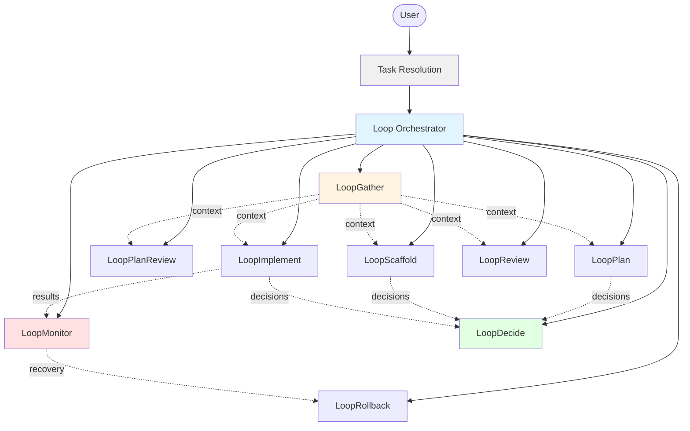
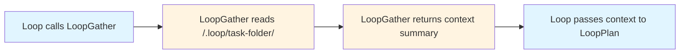

# Loop: Self-Correcting Multi-Agent Orchestration

> A meta-loop orchestrator for VS Code that ensures multi-agent engineering workflows converge, maintain coherence, and recover from stalls.

## Why Loop Exists

Multi-agent AI systems are powerful—they can complete 50k+ line codebases in days—but they have two critical problems:

1. **The Loop Problem**: When agent workflows stall, regress, or oscillate, there's no system-level awareness to detect and correct the failure mode. Loops happen *within* agents, not *between* them.

2. **The Context Coherence Problem**: Agents can't query *why* prior agents made decisions. Code may pass tests but contradict architectural intent because the reasoning trail doesn't persist.

Loop solves both by adding:
- **Meta-loop monitoring** that watches agent batches for stalls, regressions, and oscillations
- **Shared memory with decision trails** that preserves architectural reasoning across iterations
- **Fully thin orchestration** where no agent reads full files—context is synthesized on demand

---

## Architecture Overview

Loop uses a **flat, single-level hierarchy**: the orchestrator calls subagents, but subagents never call each other. All context flows through shared memory.



### Shared Memory Structure

Each task gets its own folder under `/.loop/` with an auto-incremented, human-readable ID:

```
/.loop/
├── 001-add-user-auth/    # First task
│   ├── context.md        # Synthesized context for agents
│   ├── plan.md           # Task breakdown + progress checkboxes
│   ├── loop-state.md     # Meta-loop status (iteration, health)
│   ├── report.md         # Final implementation summary
│   └── learnings/        # Reasoning trail with dependencies
│       ├── 001-auth-jwt.md
│       ├── 002-api-rest.md
│       └── 003-anti-pattern.md
├── 002-fix-payment-bug/  # Second task
│   └── ...
```

**Task ID format**: `NNN-slug` where:
- `NNN` = 3-digit zero-padded sequential number (001, 002, ...)
- `slug` = kebab-case summary from request (max 40 chars, 3-5 keywords)

**Key principle**: Agents write to files, orchestrator reads nothing. Context synthesis is delegated to `LoopGather`. The `learnings/` folder is version controlled to preserve reasoning across sessions.

---

## How It Works

### Task Resolution

Before any action, the orchestrator determines which task to work on:

1. **Parse user message** for task hints (e.g., "continue 002-fix-bug", "resume the auth task")
2. **If match found**: Use that task folder
3. **If no match or ambiguous**: List available tasks with status, ask user to pick or describe new work
4. **If no tasks exist**: Create new task

This replaces file-based state tracking—the orchestrator infers context from the conversation.

### Phase 1: Planning with Coherence Checks

```mermaid
sequenceDiagram
    participant User
    participant Loop
    participant LoopGather
    participant LoopPlan
    participant LoopDecide
    participant LoopPlanReview
    participant Todo as Todo Tool
    
    User->>Loop: Request (may include task hint)
    
    alt Task hint found
        Loop->>Loop: Resolve to /.loop/NNN-slug/
    else No match or ambiguous
        Loop->>User: List tasks, ask which to continue
        User->>Loop: Pick task or describe new
    else New task
        Loop->>Loop: Create /.loop/NNN-slug/
    end
    
    Loop->>LoopGather: Get current state (task path)
    LoopGather-->>Loop: phase, ready_subtasks (writes context.md)
    
    Loop->>LoopPlan: Plan with context
    LoopPlan-->>Loop: DRAFT, NEEDS_CLARIFICATION, or plan.md
    
    alt NEEDS_CLARIFICATION
        Note over Loop: LoopPlan returns Open Questions
        Loop->>Loop: askQuestions to user
        Loop->>LoopPlan: Re-plan with Clarifications
    end
    
    alt Has Decisions
        Loop->>LoopDecide: Record decisions
        LoopDecide-->>Loop: decision summaries (inline)
    end
    
    Loop->>LoopPlanReview: Review plan + decisions (inline)
    LoopPlanReview-->>Loop: APPROVED or NEEDS REVISION
    
    alt NEEDS REVISION
        Loop->>LoopPlan: Revise with feedback (no refresh)
    else APPROVED
        Loop->>Todo: Create todos for all subtasks
        Todo-->>Loop: Todos created (all not-started)
    end
```

**What's happening:**
- `LoopGather` synthesizes prior decisions so new plans don't contradict old ones (called once at start)
- `LoopPlan` creates task breakdown, flags non-obvious choices; returns `NEEDS_CLARIFICATION` with Open Questions if user input is required
- `LoopDecide` records reasoning and returns **inline summaries** to orchestrator
- `LoopPlanReview` receives decisions inline—no context refresh needed between plan and review
- **Todo tracking** creates visibility for all subtasks in VS Code UI

---

### Phase 2: Parallel Implementation with Stall Detection

```mermaid
sequenceDiagram
    participant Loop
    participant Todo as Todo Tool
    participant LoopGather
    participant LI1 as LoopImplement 1.1
    participant LI2 as LoopImplement 1.3
    participant LI3 as LoopImplement 2.2
    participant LoopDecide
    participant LoopReview
    participant LoopMonitor
    
    Loop->>LoopGather: Get ready subtasks
    LoopGather-->>Loop: context and ready_subtasks: [1.1, 1.3, 2.2]
    
    Loop->>Todo: Mark subtasks in-progress
    
    par Parallel Implementation
        Loop->>LI1: Implement with context
        Loop->>LI2: Implement with context
        Loop->>LI3: Implement with context
    end
    
    LI1-->>Loop: Output (may include Decisions)
    LI2-->>Loop: Output (may include Decisions)
    LI3-->>Loop: Output
    
    par Parallel Decision Recording
        Loop->>LoopDecide: Record decisions from 1.1
        Loop->>LoopDecide: Record decisions from 1.3
    end
    
    LoopDecide-->>Loop: All decisions recorded
    
    Loop->>LoopReview: Review batch [1.1, 1.3, 2.2]
    LoopReview-->>Loop: Verdicts (APPROVED: 1.1, 1.3 | CHANGES: 2.2)
    
    Loop->>Todo: Mark approved subtasks completed
    
    Loop->>LoopMonitor: Batch results
    LoopMonitor-->>Loop: Status PROGRESSING
    
    alt STALLED
        Loop->>LoopGather: Fresh context
        Loop->>Loop: Change approach or escalate
    end
```

**What's happening:**
- `LoopGather` identifies independent subtasks (no unmet `depends_on`) as `ready_subtasks`
- **Todo updates** mark subtasks as in-progress before dispatch
- `Loop` dispatches **multiple `LoopImplement` calls in parallel**
- **Parallel `LoopDecide` calls** record decisions from multiple outputs simultaneously
- `LoopReview` checks all implementations against acceptance criteria
- **Todo updates** mark approved subtasks as completed
- `LoopMonitor` detects patterns: same error 3x = STALLED, metrics worsening = REGRESSING

---

## Key Features

### ✅ Meta-Loop Awareness

`LoopMonitor` tracks iteration history across batches:

| Pattern | Detection | Response |
|---------|-----------|----------|
| **STALLED** | Same error 3x or 3 consecutive failures | Re-gather context, revise approach |
| **BLOCKED** | Subtask returns BLOCKED status (external dependency, permission, or missing info) | Escalate to human immediately via `vscode/askQuestions` with blocker details |
| **REGRESSING** | Pass rate drops 2 batches in a row | `LoopRollback` to last-good checkpoint |
| **FLIP-FLOPPING** | Same subtasks oscillating 2+ iterations | `LoopRollback` + escalate to human via `vscode/askQuestions` |

**Checkpoint & Rollback Protocol:**
- `LoopRollback` creates checkpoints after scaffold and each implementation batch
- On REGRESSING/OSCILLATING, orchestrator calls `LoopRollback` to revert to last-good state
- Every rollback records an **anti-pattern** in `/.loop/learnings/NNN-anti-pattern.md`
- Anti-patterns capture what went wrong so `LoopGather` can prevent repeat failures

After 2 failed recovery attempts, escalates to user with full context.

---

### ✅ Decision Reasoning Trails

Every significant choice is recorded with:

```markdown
# Decision 001: Use JWT for Authentication

**Context**: OAuth adds deployment complexity; users are technical

**Choice**: JWT with short-lived tokens + refresh flow

**Alternatives Rejected**:
- **OAuth 2.0**: Requires additional auth server, overkill for MVP
- **Session cookies**: Harder to scale, complicates mobile apps

**Depends On**: none
**Invalidated If**: We add third-party login or non-technical users
```

`LoopGather` synthesizes these so future agents understand *why* decisions were made, preventing "code works but contradicts design" failures.

---

### ✅ Fully Thin Orchestration

The orchestrator **never reads files directly**:



Benefits:
- Orchestrator stays simple—no parsing logic
- Context synthesis is isolated and testable
- Shared memory protocol is explicit

---

### ✅ Parallel Execution

During implementation, independent subtasks run simultaneously:

```
LoopGather → ready_subtasks: [1.1, 1.3, 2.2]
📋 Mark subtasks in-progress

[PARALLEL] LoopImplement(1.1) → output1
[PARALLEL] LoopImplement(1.3) → output2
[PARALLEL] LoopImplement(2.2) → output3
[WAIT ALL]

[PARALLEL] LoopDecide(decisions from output1) → summaries1
[PARALLEL] LoopDecide(decisions from output2) → summaries2
[WAIT ALL]

LoopReview batch + decisions:[summaries] → verdicts
📋 Mark approved subtasks completed
LoopMonitor → status
```

**Parallel operations:**
- Multiple `LoopImplement` calls (independent subtasks)
- Multiple `LoopDecide` calls (independent decisions)

**Sequential operations (shared state):**
- `LoopGather` — reads shared state from active task folder
- `LoopMonitor` — needs all results
- `LoopReview` — needs all implementations + inline decision summaries
- **Todo updates** — coordinated status tracking

**No refresh between batches:** Decisions flow inline to LoopReview. LoopGather is only called at start of each new batch, not after LoopDecide.

---

### ✅ Todo Tracking

The orchestrator uses VS Code's todo tool to track all subtasks, giving users real-time visibility into progress:

**Lifecycle:**
1. **After plan approval** → Create todos for all subtasks (status: `not-started`)
2. **Before dispatch** → Mark as `in-progress` when LoopImplement starts
3. **After review** → Mark as `completed` when LoopReview approves

**Example progression:**
```
1. [completed] 1.1: Add auth middleware
2. [completed] 1.2: Create user model  
3. [in-progress] 1.3: Implement login endpoint
4. [in-progress] 2.1: Add rate limiting
5. [not-started] 2.2: Write integration tests
```

This lets users see orchestrator progress without reading log files or memory state.

---

## Agent Breakdown

| Agent | Role | Tools | Reads | Writes |
|-------|------|-------|-------|--------|
| **Loop** | Orchestrator | agent, edit, askQuestions, todo | plan.md first line (for task list status) | {task}/loop-state.md (init only) |
| **LoopGather** | Context synthesizer | read, search | {task}/plan.md, {task}/learnings/* | {task}/context.md |
| **LoopMonitor** | Stall detector | read, edit | {task}/loop-state.md | {task}/loop-state.md |
| **LoopDecide** | Decision recorder | read, edit | {task}/learnings/* (to get next ID) | {task}/learnings/NNN-*.md |
| **LoopPlan** | Planner | read, search, edit | codebase, {task}/context.md | {task}/plan.md |
| **LoopPlanReview** | Plan reviewer | read, search, askQuestions | {task}/plan.md, {task}/context.md | Nothing (returns verdict) |
| **LoopScaffold** | Scaffolder | all (code-authoring) | {task}/plan.md, {task}/context.md, codebase | {task}/plan.md (checkboxes), code files |
| **LoopImplement** | Implementer | all (code-authoring) | {task}/plan.md, {task}/context.md, codebase | {task}/plan.md (checkboxes), code files |
| **LoopReview** | Code reviewer | execute, read, search, edit, askQuestions | {task}/plan.md, {task}/context.md, codebase | {task}/report.md (final mode), {task}/learnings/*.md (anti-patterns) |
| **LoopRollback** | Checkpoint/recovery | terminal, read, edit | git history, {task}/plan.md | {task}/learnings/*.md, {task}/plan.md |

All subagents (`infer: 'hidden'`) are invoked only by the orchestrator. Only `Loop` is user-facing (`infer: 'user'`).

---

## Comparison to Other Systems

Loop builds upon insights and lessons learned from existing multi-agent approaches:

| System | Key Insight | How Loop Applies It |
|--------|-------------|---------------------|
| **Ralph Loop** | Autonomous correction until success | Meta-loop monitoring across agent batches, not just single tasks |
| **Claude Code Swarms** | Parallel specialist agents | Parallel dispatch with explicit dependency tracking and stall detection |
| **Gas Town** | Git-based audit trails | Decision reasoning trails with file-based shared memory, simpler structure |

Loop focuses on **convergence and coherence** rather than raw throughput. It's built for tasks where "working code that contradicts design" is more expensive than "slower code that's right."

---

## Getting Started

Invoke the `Loop` agent from the VS Code agent picker:

```
Build a REST API with JWT authentication
```

The orchestrator will:
1. Resolve task from user message (or list existing tasks and ask)
2. Initialize `/.loop/NNN-slug/` structure for a new task
3. Call `LoopGather` with the task path to check for existing state
4. Delegate to `LoopPlan` → `LoopPlanReview`
5. **Create todo items** for all subtasks (tracked in VS Code UI throughout execution)
6. Scaffold architecture with `LoopScaffold`
7. Implement in parallel batches with `LoopImplement` (todos update: in-progress → completed)
8. Monitor for stalls with `LoopMonitor`
9. Generate final report with `LoopReview`

All reasoning is preserved in `/.loop/{task}/learnings/` for future reference.

### Task Management

**Continue a task:** Include task hints in your message:
- "Continue 002-fix-payment-bug"
- "Resume the auth task" 
- "Keep working on dark mode"

**List tasks:** Say "list tasks" or "show tasks" to see all task folders with their status

**New task:** If no hint matches, the orchestrator will show existing tasks and ask whether to continue one or start fresh

---

## Design Principles

1. **Loops between agents, not within** — `LoopMonitor` watches collective behavior
2. **Reasoning > outputs** — Decisions record *why*, not just *what*
3. **Thin orchestrator, thick context** — Orchestrator dispatches, `LoopGather` synthesizes
4. **Parallelism + safety** — Independent subtasks run simultaneously, shared state stays sequential
5. **Progress visibility** — Todo tracking shows real-time status without reading memory files
6. **Human in the loop when needed** — `vscode/askQuestions` for ambiguous decisions, escalation on persistent stalls

---

## Future Extensions

- **Cost tracking** — Add `LoopCost` agent for tier routing (Haiku → Sonnet → Opus)
- **Cross-session resume** — Serialize full agent state for pause/resume
- **Learning across runs** — Persist "agent X is best for task type Y" patterns
- **Decision conflict detection** — Automatic flagging when code contradicts decisions

---

## License

MIT
