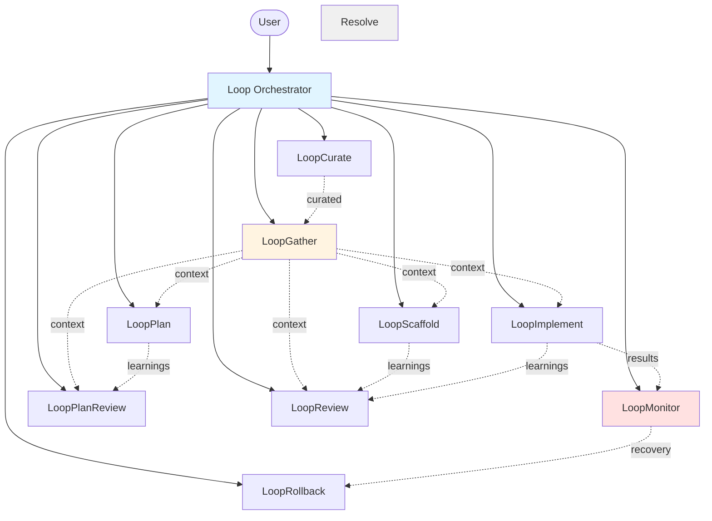
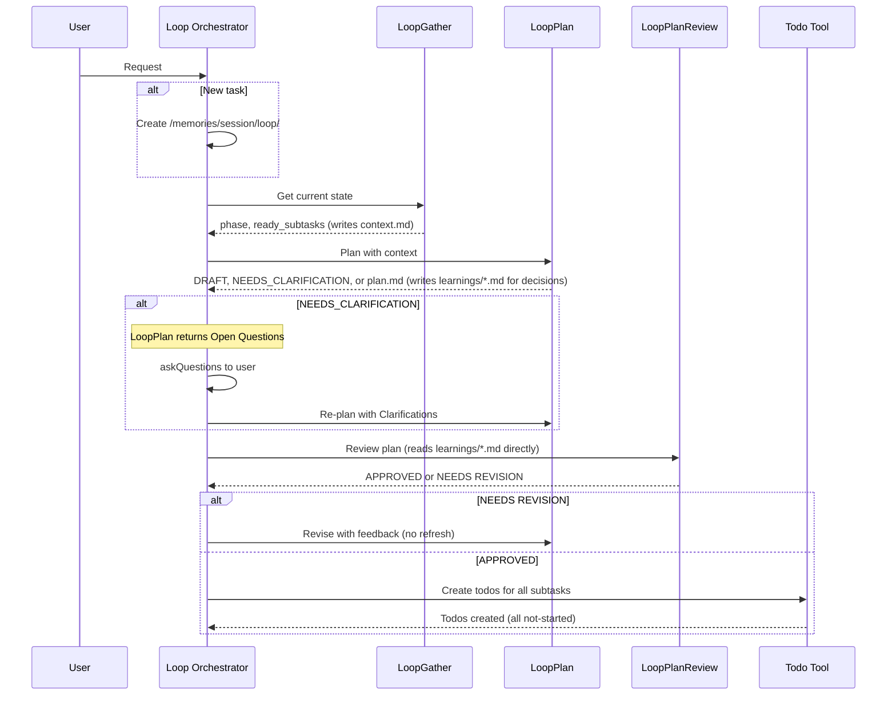
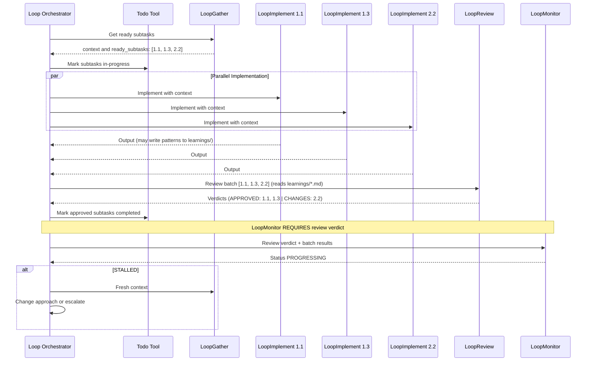
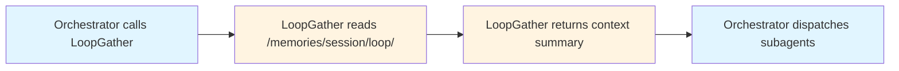

# Loop: Self-Correcting Multi-Agent Orchestration

> A meta-loop orchestrator for VS Code that ensures multi-agent engineering workflows converge, maintain coherence, and recover from stalls.

```sh
npx github:digitarald/loop-agent
```

Copies all Loop agent files into `.github/agents/` in your project. Already installed? Run with `upgrade` to pull the latest.

---

## Why Loop Exists

Multi-agent AI systems are powerful—they can complete 50k+ line codebases in days—but they have two critical problems:

1. **The Loop Problem**: When agent workflows stall, regress, or oscillate, there's no system-level awareness to detect and correct the failure mode. Loops happen *within* agents, not *between* them.

2. **The Context Coherence Problem**: Agents can't query *why* prior agents made decisions. Code may pass tests but contradict architectural intent because the reasoning trail doesn't persist.

Loop solves both by adding:
- **Meta-loop monitoring** that watches agent batches for stalls, regressions, and oscillations
- **Shared memory with decision trails** that preserves architectural reasoning across iterations
- **Fully thin orchestration** where the orchestrator never reads files directly—context synthesis is delegated to `LoopGather`

---

## Architecture Overview

Loop uses a **flat, single-level hierarchy**: the orchestrator calls subagents, but subagents never call each other. All context flows through shared memory.



### Shared Memory Structure

All loop state lives in a single flat folder:

```
/memories/session/loop/
├── context.md        # Synthesized context for agents
├── plan.md           # Task breakdown + progress checkboxes
├── loop-state.md     # Meta-loop status (iteration, health)
├── report.md         # Final implementation summary
└── learnings/        # Reasoning trail (decisions + anti-patterns)
    ├── 001-plan-decision.md
    ├── 002-scaffold-decision.md
    ├── 003-implement-pattern.md
    └── 004-review-anti-pattern.md
```

**Key principle**: Agents write to files, orchestrator reads nothing. Context synthesis is delegated to `LoopGather`. The `learnings/` folder is version controlled to preserve reasoning across sessions.

---

## How It Works

### Initialization

If `/memories/session/loop/` doesn't exist, the orchestrator creates it with empty state files. If it already has state, `LoopGather` resumes from where the task left off.

### Phase 1: Planning with Coherence Checks



**What's happening:**
- `LoopGather` synthesizes prior decisions so new plans don't contradict old ones (called once at start)
- `LoopPlan` creates task breakdown, flags non-obvious choices, writes decisions directly to `learnings/`; returns `NEEDS_CLARIFICATION` with Open Questions if user input is required
- `LoopPlanReview` reads `learnings/` directly—no context refresh needed between plan and review
- **Todo tracking** creates visibility for all subtasks in VS Code UI

---

### Phase 2: Parallel Implementation with Stall Detection



**What's happening:**
- `LoopGather` identifies independent subtasks (no unmet `depends_on`) as `ready_subtasks`
- **Todo updates** mark subtasks as in-progress before dispatch
- `Loop` dispatches **multiple `LoopImplement` calls in parallel**
- Agents write patterns and decisions directly to `learnings/` as they discover them
- `LoopReview` reads `learnings/` directly to check all implementations against acceptance criteria and decisions
- **Todo updates** mark approved subtasks as completed
- `LoopMonitor` detects patterns: same error 3x = STALLED, metrics worsening = REGRESSING

---

## Key Features

### ✅ Meta-Loop Awareness

`LoopMonitor` tracks iteration history across batches:

| Pattern | Detection | Response |
|---------|-----------|----------|
| **STALLED** | Same error 3x or 3 consecutive failures | Re-gather context, revise approach |
| **BLOCKED** | Subtask returns BLOCKED status (external dependency, permission, or missing info) | Escalate to human immediately via `vscode/askQuestions` with blocker details |
| **REGRESSING** | Pass rate drops 2 batches in a row | `LoopRollback` to last-good checkpoint |
| **FLIP-FLOPPING** | Same subtasks oscillating 2+ iterations | `LoopRollback` + escalate to human via `vscode/askQuestions` |

**Checkpoint & Rollback Protocol:**
- `LoopRollback` creates checkpoints after scaffold and each implementation batch
- On REGRESSING/OSCILLATING, orchestrator calls `LoopRollback` to revert to last-good state
- Every rollback records an **anti-pattern** in `/memories/session/loop/learnings/NNN-rollback-anti-pattern.md`
- Anti-patterns capture what went wrong so `LoopGather` can prevent repeat failures

After 2 failed recovery attempts, escalates to user with full context.

---

### ✅ Distributed Learning System

Agents capture insights directly to `learnings/` as they work.

| Agent | Writes | When | Bias |
|-------|--------|------|------|
| **LoopPlan** | `NNN-plan-decision.md` | Architectural choices, trade-offs | Record non-obvious choices |
| **LoopScaffold** | `NNN-scaffold-decision.md` | Structure changes, module organization | Record non-obvious choices |
| **LoopImplement** | `NNN-implement-pattern.md` | Gotchas, hidden constraints, rejection fixes | **Skip unless prevents mistake** |
| **LoopReview** | `NNN-review-anti-pattern.md` | Critical/Major issues found | Record all blockers |
| **LoopPlanReview** | `NNN-plan-review-rejection.md` | Why plans were sent back | Record revision reasons |
| **LoopRollback** | `NNN-rollback-anti-pattern.md` | What caused regression/stall | Record all rollbacks |

`LoopGather` synthesizes these into `context.md` so future agents benefit from past learnings. `LoopCurate` periodically consolidates the folder — merging duplicates, marking superseded entries, and pruning completed patterns — so `LoopGather` reads signal instead of noise.

---

### ✅ Decision Reasoning Trails

Every significant choice is recorded with:

```markdown
# Decision 001: Use JWT for Authentication

**Date**: 2026-02-02
**Status**: DECISION
**Source**: plan

## Context
OAuth adds deployment complexity; users are technical

## Choice
JWT with short-lived tokens + refresh flow

## Alternatives Rejected
- **OAuth 2.0**: Requires additional auth server, overkill for MVP
- **Session cookies**: Harder to scale, complicates mobile apps

## Invalidated If
We add third-party login or non-technical users
```

`LoopGather` synthesizes these so future agents understand *why* decisions were made, preventing "code works but contradicts design" failures.

---

### ✅ Fully Thin Orchestration

The orchestrator **never reads files directly**:



Benefits:
- Orchestrator stays simple—no parsing logic
- Context synthesis is isolated and testable
- Shared memory protocol is explicit

---

### ✅ Visual Verification

`LoopReview` goes beyond build/test checks—for web projects, it starts the dev server, opens the app in a browser, takes screenshots, and checks the console for errors. This catches issues invisible to linters and type checkers: module format mismatches, PostCSS/Tailwind compilation failures, missing runtime dependencies, and layout/rendering problems.

---

### ✅ Parallel Execution

During implementation, independent subtasks run simultaneously:

```
LoopGather → ready_subtasks: [1.1, 1.3, 2.2]
📋 Mark subtasks in-progress

[PARALLEL] LoopImplement(1.1) → output1, writes learnings/*.md if patterns found
[PARALLEL] LoopImplement(1.3) → output2
[PARALLEL] LoopImplement(2.2) → output3
[WAIT ALL]

LoopReview batch (reads learnings/*.md) → verdicts
📋 Mark approved subtasks completed
LoopMonitor (requires review verdict) → status
```

**Critical sequence:** `LoopReview` MUST complete before `LoopMonitor`. The monitor validates review data exists and returns `BLOCKED: Missing batch review` if called without it. This prevents implementations from shipping without quality checks.

**Parallel operations:**
- Multiple `LoopImplement` calls (independent subtasks)
- Multiple `LoopScaffold` calls (if plan has independent scaffold tasks)

**Sequential operations (shared state):**
- `LoopGather` — reads shared state from `/memories/session/loop/`
- `LoopReview` — needs all implementations + learnings (MUST run before monitor)
- `LoopMonitor` — needs review verdict + batch results (enforces review requirement)
- **Todo updates** — coordinated status tracking

**No refresh between batches:** Learnings flow through files. LoopGather is only called at start of each new batch.

---

### ✅ Todo Tracking

The orchestrator uses VS Code's todo tool to track all subtasks, giving users real-time visibility into progress:

**Lifecycle:**
1. **After plan approval** → Create todos for all subtasks (status: `not-started`)
2. **Before dispatch** → Mark as `in-progress` when LoopImplement starts
3. **After review** → Mark as `completed` when LoopReview approves

**Example progression:**
```
1. [completed] 1.1: Add auth middleware
2. [completed] 1.2: Create user model  
3. [in-progress] 1.3: Implement login endpoint
4. [in-progress] 2.1: Add rate limiting
5. [not-started] 2.2: Write integration tests
```

This lets users see orchestrator progress without reading log files or memory state.

---

## Agent Breakdown

| Agent | Role | Tools | Reads | Writes |
|-------|------|-------|-------|--------|
| **Loop** | Orchestrator | agent, read, search, todo, vscode/askQuestions, vscode/memory | plan.md first line (for status) | loop-state.md (init only) |
| **LoopGather** | Context synthesizer | read, search, vscode/memory | plan.md, learnings/* | context.md |
| **LoopMonitor** | Stall detector | search, read, vscode/memory | loop-state.md | loop-state.md |
| **LoopPlan** | Planner | read, search, github/web_search, vscode/memory | codebase, context.md | plan.md, learnings/NNN-plan-decision.md |
| **LoopPlanReview** | Plan reviewer | read, search, github/web_search, vscode/memory | plan.md, context.md, learnings/* | learnings/NNN-plan-review-rejection.md |
| **LoopScaffold** | Scaffolder | all | plan.md, context.md, codebase | plan.md (checkboxes), code files, learnings/NNN-scaffold-decision.md |
| **LoopImplement** | Implementer | all | plan.md, context.md, codebase | plan.md (checkboxes), code files, learnings/NNN-implement-pattern.md |
| **LoopReview** | Code reviewer | all | plan.md, context.md, learnings/*, codebase | report.md (final mode), learnings/NNN-review-anti-pattern.md |
| **LoopRollback** | Checkpoint/recovery | execute, read, vscode/memory | git history, plan.md | learnings/NNN-rollback-anti-pattern.md, plan.md |
| **LoopCurate** | Learnings curator | vscode/memory | learnings/* | learnings/* (merged/pruned) |

**Model tier routing:** Agents are assigned to cost-appropriate models. Cheap/fast models (Gemini 3 Flash, Claude Haiku 4.5, GLM 4.7) handle context gathering, implementation, monitoring, and rollback. Expensive models (GPT-5.2-Codex) handle planning where reasoning quality matters most.

---

## Comparison to Other Systems

Loop builds upon insights and lessons learned from existing multi-agent approaches:

| System | Key Insight | How Loop Applies It |
|--------|-------------|---------------------|
| **Ralph Loop** | Autonomous correction until success | Meta-loop monitoring across agent batches, not just single tasks |
| **Claude Code Swarms** | Parallel specialist agents | Parallel dispatch with explicit dependency tracking and stall detection |
| **Gas Town** | Git-based audit trails | Decision reasoning trails with file-based shared memory, simpler structure |

Loop focuses on **convergence and coherence** rather than raw throughput. It's built for tasks where "working code that contradicts design" is more expensive than "slower code that's right."

---

## Getting Started

Invoke the `Loop` agent from the VS Code agent picker:

```
Build a REST API with JWT authentication
```

The orchestrator will:
1. Initialize `/memories/session/loop/` structure (or resume if state exists)
2. Call `LoopGather` to check for existing state
3. Delegate to `LoopPlan` → `LoopPlanReview`
4. **Create todo items** for all subtasks (tracked in VS Code UI throughout execution)
5. Scaffold architecture with `LoopScaffold`
6. Implement in parallel batches with `LoopImplement` (todos update: in-progress → completed)
7. Monitor for stalls with `LoopMonitor`
8. Generate final report with `LoopReview`
9. Curate learnings with `LoopCurate` before commit

All reasoning is preserved in `/memories/session/loop/learnings/` for future reference.

---

## Design Principles

1. **Loops between agents, not within** — `LoopMonitor` watches collective behavior
2. **Reasoning > outputs** — Decisions record *why*, not just *what*
3. **Thin orchestrator, thick context** — Orchestrator dispatches, `LoopGather` synthesizes
4. **Parallelism + safety** — Independent subtasks run simultaneously, shared state stays sequential
5. **Progress visibility** — Todo tracking shows real-time status without reading memory files
6. **Human in the loop when needed** — `vscode/askQuestions` for ambiguous decisions, escalation on persistent stalls

---

## Future Extensions

- **Cross-session resume** — Serialize full agent state for pause/resume
- **Learning across runs** — Persist "agent X is best for task type Y" patterns
- **Decision conflict detection** — Automatic flagging when code contradicts decisions

---

## License

MIT
