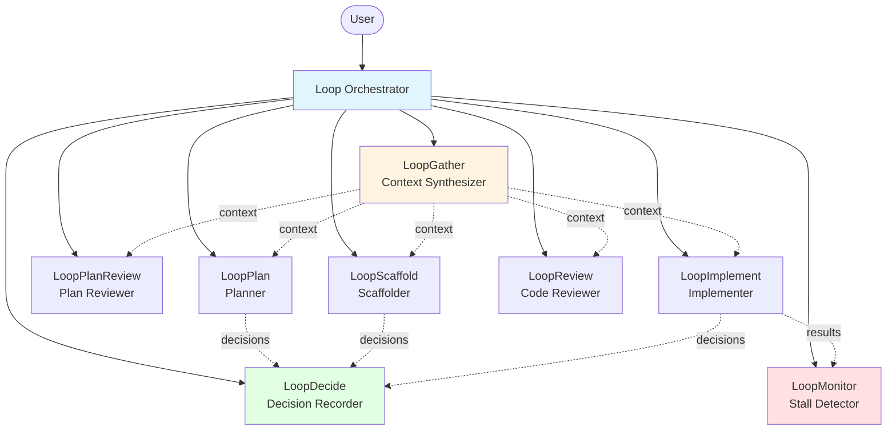
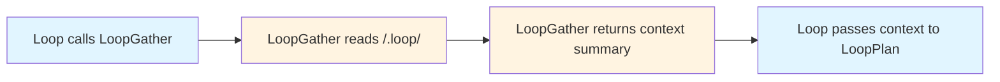

# Loop: Self-Correcting Multi-Agent Orchestration

> A meta-loop orchestrator for VS Code that ensures multi-agent engineering workflows converge, maintain coherence, and recover from stalls.

## Why Loop Exists

Multi-agent AI systems are powerful—they can complete 50k+ line codebases in days—but they have two critical problems:

1. **The Loop Problem**: When agent workflows stall, regress, or oscillate, there's no system-level awareness to detect and correct the failure mode. Loops happen *within* agents, not *between* them.

2. **The Context Coherence Problem**: Agents can't query *why* prior agents made decisions. Code may pass tests but contradict architectural intent because the reasoning trail doesn't persist.

Loop solves both by adding:
- **Meta-loop monitoring** that watches agent batches for stalls, regressions, and oscillations
- **Shared memory with decision trails** that preserves architectural reasoning across iterations
- **Fully thin orchestration** where no agent reads full files—context is synthesized on demand

---

## Architecture Overview

Loop uses a **flat, single-level hierarchy**: the orchestrator calls subagents, but subagents never call each other. All context flows through shared memory.



### Shared Memory Structure

All agents read/write to `/.loop/`:

```
/.loop/
├── plan.md              # Task breakdown + progress checkboxes
├── loop-state.md        # Meta-loop status (iteration, health)
├── report.md            # Final implementation summary
└── decisions/           # Reasoning trail with dependencies
    ├── 001-auth-jwt.md
    ├── 002-api-rest.md
    └── ...
```

**Key principle**: Agents write to files, orchestrator reads nothing. Context synthesis is delegated to `LoopGather`.

---

## How It Works

### Phase 1: Planning with Coherence Checks

```mermaid
sequenceDiagram
    participant Loop
    participant LoopGather
    participant LoopPlan
    participant LoopDecide
    participant LoopPlanReview
    participant Todo[Todo Tool]
    
    Loop->>LoopGather: Get current state
    LoopGather-->>Loop: status, prior decisions, context
    
    Loop->>LoopPlan: Plan with context
    LoopPlan-->>Loop: plan.md with Decisions section
    
    alt Has Decisions
        Loop->>LoopDecide: Record decisions
        LoopDecide-->>Loop: decisions files created
        Loop->>LoopGather: Get updated context
        LoopGather-->>Loop: context with new decisions
    end
    
    Loop->>LoopPlanReview: Review plan with context
    LoopPlanReview-->>Loop: APPROVED or NEEDS REVISION
    
    alt NEEDS REVISION
        Loop->>LoopPlan: Revise with feedback
    else APPROVED
        Loop->>Todo: Create todos for all subtasks
        Todo-->>Loop: Todos created (all not-started)
    end
```

**What's happening:**
- `LoopGather` synthesizes prior decisions so new plans don't contradict old ones
- `LoopPlan` creates task breakdown, flags non-obvious choices
- `LoopDecide` records reasoning (not just choices) to `/.loop/decisions/`
- `LoopPlanReview` validates coherence with prior decisions, flags contradictions as Critical
- **Todo tracking** creates visibility for all subtasks in VS Code UI

---

### Phase 2: Parallel Implementation with Stall Detection

```mermaid
sequenceDiagram
    participant Loop
    participant Todo[Todo Tool]
    participant LoopGather
    participant LI1[LoopImplement<br/>Subtask 1.1]
    participant LI2[LoopImplement<br/>Subtask 1.3]
    participant LI3[LoopImplement<br/>Subtask 2.2]
    participant LoopDecide
    participant LoopReview
    participant LoopMonitor
    
    Loop->>LoopGather: Get ready subtasks
    LoopGather-->>Loop: context and ready_subtasks: [1.1, 1.3, 2.2]
    
    Loop->>Todo: Mark subtasks in-progress
    
    par Parallel Implementation
        Loop->>LI1: Implement with context
        Loop->>LI2: Implement with context
        Loop->>LI3: Implement with context
    end
    
    LI1-->>Loop: Output (may include Decisions)
    LI2-->>Loop: Output (may include Decisions)
    LI3-->>Loop: Output
    
    par Parallel Decision Recording
        Loop->>LoopDecide: Record decisions from 1.1
        Loop->>LoopDecide: Record decisions from 1.3
    end
    
    LoopDecide-->>Loop: All decisions recorded
    
    Loop->>LoopReview: Review batch [1.1, 1.3, 2.2]
    LoopReview-->>Loop: Verdicts (APPROVED: 1.1, 1.3 | CHANGES: 2.2)
    
    Loop->>Todo: Mark approved subtasks completed
    
    Loop->>LoopMonitor: Batch results
    LoopMonitor-->>Loop: Status PROGRESSING
    
    alt STALLED
        Loop->>LoopGather: Fresh context
        Loop->>Loop: Change approach or escalate
    end
```

**What's happening:**
- `LoopGather` identifies independent subtasks (no unmet `depends_on`) as `ready_subtasks`
- **Todo updates** mark subtasks as in-progress before dispatch
- `Loop` dispatches **multiple `LoopImplement` calls in parallel**
- **Parallel `LoopDecide` calls** record decisions from multiple outputs simultaneously
- `LoopReview` checks all implementations against acceptance criteria
- **Todo updates** mark approved subtasks as completed
- `LoopMonitor` detects patterns: same error 3x = STALLED, metrics worsening = REGRESSING

---

## Key Features

### ✅ Meta-Loop Awareness

`LoopMonitor` tracks iteration history across batches:

| Pattern | Detection | Response |
|---------|-----------|----------|
| **STALLED** | Same error 3x or 3 consecutive failures | Re-gather context, revise approach |
| **REGRESSING** | Pass rate drops 2 batches in a row | Rollback to last-good state |
| **OSCILLATING** | Same subtasks flip-flopping 2+ iterations | Escalate to human via `vscode/askQuestions` |

After 2 failed recovery attempts, escalates to user with full context.

---

### ✅ Decision Reasoning Trails

Every significant choice is recorded with:

```markdown
# Decision 001: Use JWT for Authentication

**Context**: OAuth adds deployment complexity; users are technical

**Choice**: JWT with short-lived tokens + refresh flow

**Alternatives Rejected**:
- **OAuth 2.0**: Requires additional auth server, overkill for MVP
- **Session cookies**: Harder to scale, complicates mobile apps

**Depends On**: none
**Invalidated If**: We add third-party login or non-technical users
```

`LoopGather` synthesizes these so future agents understand *why* decisions were made, preventing "code works but contradicts design" failures.

---

### ✅ Fully Thin Orchestration

The orchestrator **never reads files directly**:



Benefits:
- Orchestrator stays simple—no parsing logic
- Context synthesis is isolated and testable
- Shared memory protocol is explicit

---

### ✅ Parallel Execution

During implementation, independent subtasks run simultaneously:

```
LoopGather → ready_subtasks: [1.1, 1.3, 2.2]
📋 Mark subtasks in-progress

[PARALLEL] LoopImplement(1.1) → output1
[PARALLEL] LoopImplement(1.3) → output2
[PARALLEL] LoopImplement(2.2) → output3
[WAIT ALL]

[PARALLEL] LoopDecide(decisions from output1)
[PARALLEL] LoopDecide(decisions from output2)
[WAIT ALL]

LoopReview batch → verdicts
📋 Mark approved subtasks completed
LoopMonitor → status
```

**Parallel operations:**
- Multiple `LoopImplement` calls (independent subtasks)
- Multiple `LoopDecide` calls (independent decisions)

**Sequential operations (shared state):**
- `LoopGather` — reads shared state
- `LoopMonitor` — needs all results
- `LoopReview` — needs all implementations
- **Todo updates** — coordinated status tracking

---

### ✅ Todo Tracking

The orchestrator uses VS Code's todo tool to track all subtasks, giving users real-time visibility into progress:

**Lifecycle:**
1. **After plan approval** → Create todos for all subtasks (status: `not-started`)
2. **Before dispatch** → Mark as `in-progress` when LoopImplement starts
3. **After review** → Mark as `completed` when LoopReview approves

**Example progression:**
```
1. [completed] 1.1: Add auth middleware
2. [completed] 1.2: Create user model  
3. [in-progress] 1.3: Implement login endpoint
4. [in-progress] 2.1: Add rate limiting
5. [not-started] 2.2: Write integration tests
```

This lets users see orchestrator progress without reading log files or memory state.

---

## Agent Breakdown

| Agent | Role | Tools | Reads | Writes |
|-------|------|-------|-------|--------|
| **Loop** | Orchestrator | agent, edit, askQuestions, todo | Nothing (delegates to LoopGather) | loop-state.md (init only) |
| **LoopGather** | Context synthesizer | read, search | plan.md, decisions/* | Nothing (returns context) |
| **LoopMonitor** | Stall detector | read, edit | loop-state.md | loop-state.md |
| **LoopDecide** | Decision recorder | read, edit | decisions/* (to get next ID) | decisions/NNN-*.md |
| **LoopPlan** | Planner | read, search, edit | codebase | plan.md |
| **LoopPlanReview** | Plan reviewer | read, search, askQuestions | plan.md | Nothing (returns verdict) |
| **LoopScaffold** | Scaffolder | all (code-authoring) | plan.md, codebase | plan.md (checkboxes), code files |
| **LoopImplement** | Implementer | all (code-authoring) | plan.md, codebase | plan.md (checkboxes), code files |
| **LoopReview** | Code reviewer | execute, read, search, edit, askQuestions | plan.md, codebase | report.md (final mode) |

All subagents (`infer: 'hidden'`) are invoked only by the orchestrator. Only `Loop` is user-facing (`infer: 'user'`).

---

## Comparison to Other Systems

Loop builds upon insights and lessons learned from existing multi-agent approaches:

| System | Key Insight | How Loop Applies It |
|--------|-------------|---------------------|
| **Ralph Loop** | Autonomous correction until success | Meta-loop monitoring across agent batches, not just single tasks |
| **Claude Code Swarms** | Parallel specialist agents | Parallel dispatch with explicit dependency tracking and stall detection |
| **Gas Town** | Git-based audit trails | Decision reasoning trails with file-based shared memory, simpler structure |

Loop focuses on **convergence and coherence** rather than raw throughput. It's built for tasks where "working code that contradicts design" is more expensive than "slower code that's right."

---

## Getting Started

Invoke the `Loop` agent from the VS Code agent picker:

```
Build a REST API with JWT authentication
```

The orchestrator will:
1. Initialize `/.loop/` structure
2. Call `LoopGather` to check for existing state
3. Delegate to `LoopPlan` → `LoopPlanReview`
4. **Create todo items** for all subtasks (tracked in VS Code UI throughout execution)
5. Scaffold architecture with `LoopScaffold`
6. Implement in parallel batches with `LoopImplement` (todos update: in-progress → completed)
7. Monitor for stalls with `LoopMonitor`
8. Generate final report with `LoopReview`

All reasoning is preserved in `/.loop/decisions/` for future reference.

---

## Design Principles

1. **Loops between agents, not within** — `LoopMonitor` watches collective behavior
2. **Reasoning > outputs** — Decisions record *why*, not just *what*
3. **Thin orchestrator, thick context** — Orchestrator dispatches, `LoopGather` synthesizes
4. **Parallelism + safety** — Independent subtasks run simultaneously, shared state stays sequential
5. **Progress visibility** — Todo tracking shows real-time status without reading memory files
6. **Human in the loop when needed** — `vscode/askQuestions` for ambiguous decisions, escalation on persistent stalls

---

## Future Extensions

- **Cost tracking** — Add `LoopCost` agent for tier routing (Haiku → Sonnet → Opus)
- **Cross-session resume** — Serialize full agent state for pause/resume
- **Learning across runs** — Persist "agent X is best for task type Y" patterns
- **Decision conflict detection** — Automatic flagging when code contradicts decisions

---

## License

MIT
